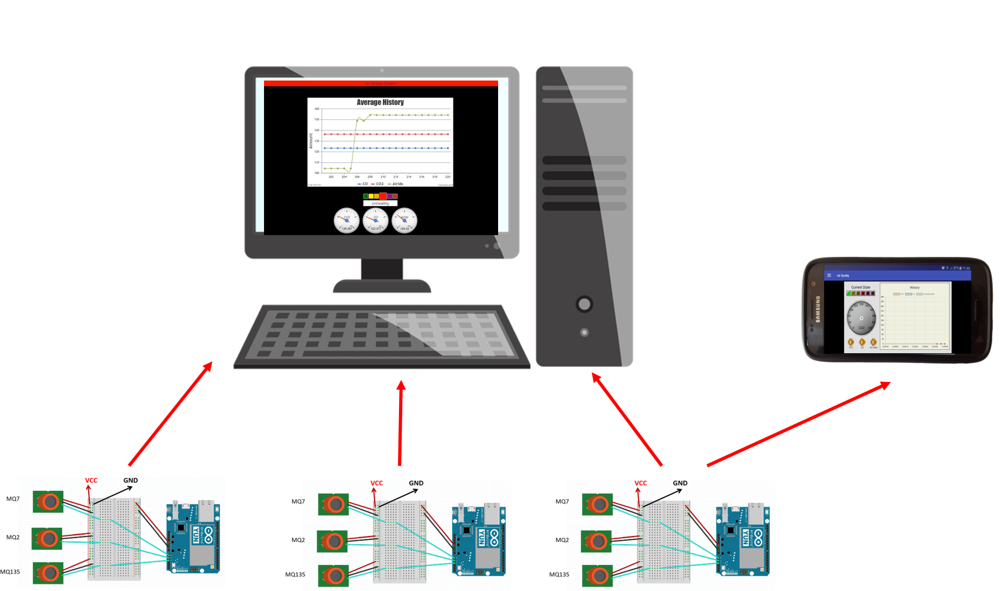

# Air Quality Monitoring System
In this project we developed a multi-location air quality monitoring system as our Embedded Systems & IoT Design course project. 

## Built With

* [Proteus IoT Builder](https://www.labcenter.com/iotbuilder/) - An extension to Proteus software providing an end to end workflow for the design of IoT appliances on Arduino hardware. 
* [ElasticSearch 7.8](https://www.elastic.co/downloads/elasticsearch) - A search engine providing a distributed, multitenant-capable search with an HTTP web interface.

## Authors
* **Koosha Jaferian** - [mrkooshaj](https://gitlab.com/mrkooshaj)
* **Soroush Baselizadeh** - [Soroosh-Bsl](https://gitlab.com/Soroosh-Bsl)
* **Yasamin Tabatabaee** - [y-tabatabaee76](https://gitlab.com/y-tabatabaee76)

